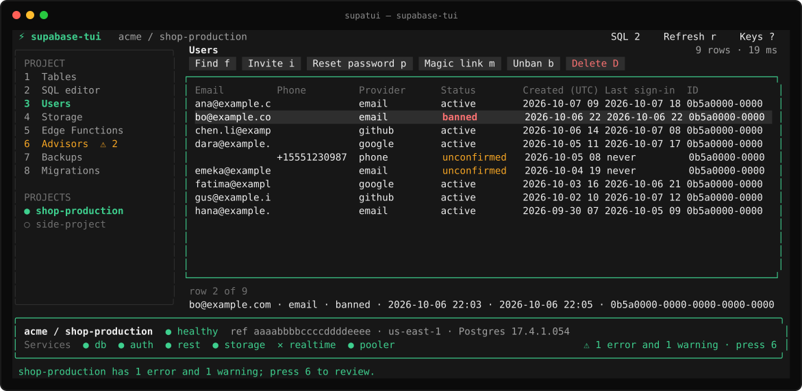

# Run Supabase. Stay in your terminal.

supabase-tui is a terminal console for your Supabase projects on macOS and Linux.
Switch between every project you can access, check its health and advisor
findings, browse tables, run SQL, manage Auth users, browse and share Storage
files, and review Edge Functions, backups and migrations. The installed
executable and the Cargo package are named `supatui`.

The terminal interface is written in HTML and CSS with
[Hypercmd](https://github.com/fusor-rs/hypercmd) and
[Fusor](https://github.com/fusor-rs/fusor). Data comes from the
[Supabase Management API](https://supabase.com/docs/reference/api/introduction)
and each project's Storage and Auth APIs.

**In development · v0.1** — See [status and known limitations](#status-and-known-limitations).

<p align="center">
  
</p>

[Get started](#get-started) · [Using supabase-tui](#using-supabase-tui) ·
[How it works](#how-it-works) · [Status](#status-and-known-limitations) ·
[Contributing](#contributing)

## Get started

supabase-tui runs in a terminal on macOS or Linux. You need a Supabase account and a
[personal access token](https://supabase.com/dashboard/account/tokens). On Linux,
saving the token requires an unlocked Secret Service provider, such as GNOME
Keyring, on your session D-Bus.

### Install with Cargo

Cargo is Rust's package manager, included when you install Rust through
[rustup](https://rustup.rs). After a supabase-tui release is published to
crates.io, you can install the `supatui` executable with:

```sh
cargo install supatui --locked
supatui
```

`--locked` uses the dependency versions recorded in the release. Cargo installs
`supatui` in `~/.cargo/bin` by default; that directory needs to be in your shell's
PATH.

### Install a binary release

The shell installer downloads the latest published GitHub release for x86-64 or
ARM64 on Linux or macOS. It verifies the download's SHA-256 checksum and the
executable's version, and installs `supatui` in `~/.supabase-tui/bin`, without
sudo or a Rust toolchain:

```sh
curl -fsSL https://raw.githubusercontent.com/fusor-rs/supabase-tui/main/install.sh | sh
export PATH="$HOME/.supabase-tui/bin:$PATH"
supatui
```

Add the `export` line to your shell profile, such as `~/.zshrc` or `~/.bashrc`, so
new terminals can find `supatui`. Run `supatui upgrade` to upgrade. To select a
release, append `-s -- v0.1.0` to `sh`, or set `SUPABASE_TUI_VERSION` on the `sh`
command. Set `SUPABASE_TUI_INSTALL` on the `sh` command to choose a different install
directory; the executable goes in its `bin/`.

Linux binaries need glibc 2.35 or newer, as on Ubuntu 22.04 or newer, and no other
libraries: TLS and D-Bus are built in, and HTTPS uses the system's CA
certificates. Alpine's musl runtime is not supported. The installer requires
`curl`, `tar`, and either `sha256sum` or `shasum`.

This method requires a GitHub release with completed binary uploads.

### Upgrade

Run this to update to the latest stable version:

```sh
supatui upgrade
```

If you're already up to date, nothing happens. A copy installed with Cargo is
upgraded with Cargo; one installed with the shell installer is upgraded with the
same checksum-verified installer, in the same directory. Your saved access token
stays in place.

To check which version you're running, use `supatui --version`.

### Log in

1. Create a token in the dashboard under **Account → Access Tokens**.
2. Run `supatui`, paste the token and press Enter.

The token is checked against Supabase, then stored in macOS Keychain or Linux
Secret Service, so later starts open your projects directly. Run `supatui logout`
to remove it. When `SUPABASE_ACCESS_TOKEN` is set, as for the Supabase CLI,
`supatui` uses it instead of the saved token. The pasted token is visible in the
input while you paste it.

See [Using supabase-tui](#using-supabase-tui) for projects, sections and actions.

### Build from source

With Rust and Cargo installed, clone the repository and install from the checkout:

```sh
git clone https://github.com/fusor-rs/supabase-tui
cd supabase-tui
cargo install --path . --locked
supatui
```

On macOS, building requires the Xcode Command Line Tools (`xcode-select --install`).
On Debian or Ubuntu, install `build-essential` first.
For development, `cargo run --locked` builds and launches the app from the checkout.

## Using supabase-tui

### Projects

The sidebar lists the sections of the selected project and, below them, every
project in your organizations: `●` healthy, `◐` changing state, `○` paused, `✕`
unhealthy or failed. The bar at the bottom shows the project's status, reference
ID, region, Postgres version and the health of its database, Auth, REST,
Storage, Realtime and pooler services. Projects and health are checked again every
30 seconds; press `r` to refresh now.

A paused project shows a **Restore** button; press it or `R` to bring the project
back up.

When the security or performance advisors have errors or warnings, the status bar
and the sidebar's Advisors entry show how many, and a notice says so when you open
the project. Press `6` to see them: the Advisors view explains the selected
finding under the list, and `o` opens its remediation guide.

### Sections

| Key | Section | Shows |
| --- | --- | --- |
| `1` | Tables | Every table outside the Postgres system schemas, with estimated rows, size and whether row-level security is enabled. Enter opens a table's first 100 rows. |
| `2` | SQL editor | Write a query and press Ctrl+R to run it. Results show below the editor. |
| `3` | Users | The 500 most recent Auth users, with provider, status and last sign-in. Enter shows a user's identities, sessions, MFA factors and metadata. |
| `4` | Storage | Buckets and whether they are public. Enter opens a bucket, then its folders; Enter on a file previews it. |
| `5` | Edge Functions | Deployed functions, their version, JWT verification and last update. |
| `6` | Advisors | Security and performance advisor findings, errors first. |
| `7` | Backups | Logical and physical backups and their status. |
| `8` | Migrations | Applied migrations, newest first. |

Enter opens any other row in full, one column per line, which helps with wide
rows and long values. Values that need attention are colored in every list:
banned or unconfirmed users, failed backups, tables without row-level security,
public buckets, and advisor errors and warnings.

Press `/` in any list to filter its rows as you type; Enter keeps the filter and
Esc clears it. Press `f` in Users or Storage to find beyond the loaded rows: users
whose email, phone or ID contains the text, or files whose path does, in the
current bucket or, from the bucket list, in every bucket.

### Users

The Users view has a toolbar for these actions and a line under the list that
describes the selected user. Click a button, or with a user selected, or open:

| Key | Action |
| --- | --- |
| `i` | Invite a user by email |
| `p` | Email a password reset link |
| `m` | Email a sign-in (magic) link |
| `b` | Ban the user, or lift their ban |
| `D` | Delete the user |

Everything except invitations asks for confirmation first. Emails use the
project's Auth email settings and rate limits.

### Storage files

The Storage view shows the path from the bucket list to the current folder; click
any part of it to go back there. Its toolbar holds the file actions, and the line
under the list describes the selected file. Click a button, or with a file
selected, or open:

| Key | Action |
| --- | --- |
| `Enter` | Preview: the first 64 kB of text files; details for others |
| `o` | Open the file in your browser, through a signed URL |
| `u` | Create a signed URL valid for one hour and copy it to the clipboard |
| `d` | Download the file to `~/Downloads`, next to any file with the same name |

Images and other binary files are viewed in the browser with `o`. Copying uses
`pbcopy` on macOS and `wl-copy` or `xclip` on Linux; the dialog also shows the URL.

The SQL editor runs queries as `supabase_read_only_user` while its **Read-only**
box is checked, which is the default. Clear the box to run as `postgres`, as the
dashboard's SQL editor does; those writes are permanent. Tables and Users always
read through the read-only role.

### Keyboard and mouse

Press `?` in the console to see the keys. Click the sidebar entries and buttons,
or scroll the grid with the mouse wheel.

<details>
<summary>Keys</summary>

| Key | Action |
| --- | --- |
| `1` – `8` | Open a section |
| `↑` / `↓` / `PgUp` / `PgDn` / `Home` / `End` | Choose a row |
| `←` / `→` | Scroll columns of a wide grid |
| `Enter` | Open the selected table, bucket, folder, file, user or row |
| `/` | Filter the rows |
| `f` | Find users or files |
| `Esc` / `Backspace` | Clear the filter; go back; leave the SQL editor |
| `Ctrl+R` | Run the SQL editor's query |
| `r` | Refresh |
| `R` | Restore a paused project |
| `Tab` / `Shift+Tab` | Move between the sidebar, editor and grid |
| `?` | Show keys |
| `q` / `Ctrl+C` | Quit |

Single-key shortcuts apply outside text inputs.

</details>

## How it works

- **Management API.** Project, health, advisor and SQL requests go to
  `https://api.supabase.com/v1` with your personal access token. Tables, users,
  table rows and storage file listings are SQL queries sent through the API's
  read-only query endpoint, with search text bound as query parameters; no
  database password or connection string is needed.
- **Project APIs.** Downloads, previews, signed URLs and user actions call the
  project's Storage and Auth APIs at `https://<ref>.supabase.co`. The first such
  action fetches the project's secret API key through the Management API (or the
  legacy `service_role` key when the project has no secret key); the key stays in
  memory and is never saved or shown.
- **One grid, section panels.** Every section becomes rows of text under named
  columns, shown in one [grid](ui/grid.html) that renders only the rows and columns
  that fit. The SQL editor, [Storage](ui/storage.html), [Users](ui/users.html) and
  [Advisors](ui/advisors.html) add their own panel above it and a
  [details line](ui/details.html) below it.
- **HTML views, Rust state.** Hypercmd compiles the [HTML templates](ui/) at build
  time and connects them to [Rust state](src/console/). Requests run on a Tokio
  runtime and never block the interface.

## Status and known limitations

supabase-tui is in early development.

| Capability | Status |
| --- | --- |
| Projects | List, status, health and restoring paused projects |
| Database | Tables, table previews, SQL editor, migrations and backups |
| Auth | Users, search, details, invitations, reset and magic links, bans, deletion |
| Storage | Buckets, folders, file search, text previews, signed URLs, downloads |
| Edge Functions | Deployed functions |
| Advisors | Security and performance findings |
| Token storage | macOS Keychain or Linux Secret Service |
| Terminal platforms | macOS and Linux |

Editing rows, creating users, uploading or deleting files, logs, branches and
changing project settings are not implemented. Table previews, the user list and
file search results are limited to their first rows. Windows is not supported.

## Contributing

Read [AGENTS.md](AGENTS.md) for the repository's coding and review rules. The
Supabase API clients live in `src/supabase/`, with their SQL in
`src/supabase/sql/`, terminal state in `src/console/`, and views in `ui/`.
`ui/app.html` composes the sidebar, the shared grid, the section panels for SQL,
Storage, Users and Advisors, and the dialogs. Templates are registered in
`src/console/view.rs`; styles live in `ui/terminal.css`. Dependency versions are
pinned.

Run the required checks:

```sh
sh -n install.sh
cargo fmt --all -- --check
cargo clippy --all-targets --locked -- -D warnings
cargo test --locked
```

The [Check workflow](.github/workflows/check.yml) runs these checks on Linux and
macOS for pushes and pull requests, lints the installer, verifies the crate
package, and launches the executable.

## License

Licensed under the [MIT License](LICENSE).
